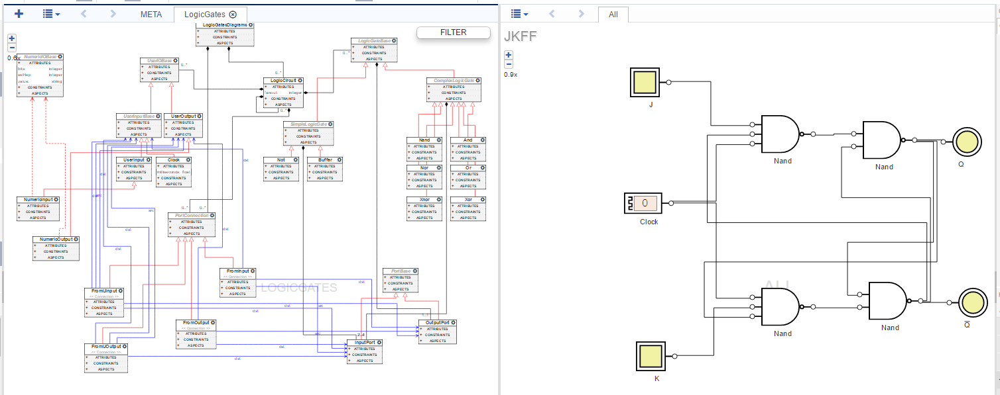

# Logic Gates
[Logic Gates](https://en.wikipedia.org/wiki/Logic_gate) domain with seed, decorator, and plugin for generating .



## Run as a standalone webgme app
Make sure the [dependencies for webgme](https://github.com/webgme/webgme/blob/master/README.md#dependencies) are installed.
 1. Clone this repository or from an empty directory do `npm install webgme-logic-gates`. From the root of this module (i.e. where this README.md is do the following commands).
 2. `npm install` - installs all dependencies
 3. `npm install webgme` - installs webgme (it's a [peer-dependency](https://nodejs.org/en/blog/npm/peer-dependencies/)).
 4. Launch a local mongodb instance (if not local edit the webgme config).
 5. `npm start`
 6. Visit localhost:8888 from a browser.

## Import components into your own webgme repo
Using the [webgme-cli](https://github.com/webgme/webgme-cli) the following pieces can be imported (execute from root of repository).

#### Seed
Serialized model containing the logic-gates metamodel and some examples.
```
webgme import seed FiniteStateMachine webgme-logic-gates
```
#### Decorator
Decorates the gates, ports, and circuits in an appropriate fashion. The seed already registers the decorator for the appropriate nodes.
```
webgme import decorator LogicGatesDecorator webgme-logic-gates
```

## Developers

#### Publish new release at npm
 ```
 npm prune
 npm install
 npm version 1.1.0 -m "Release %s"
 git push origin master
 git checkout v1.1.0
 git push origin v1.1.0
 npm publish ./
 ```